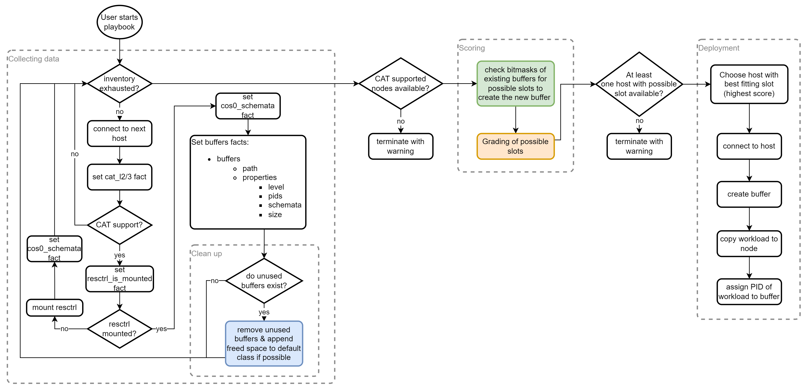
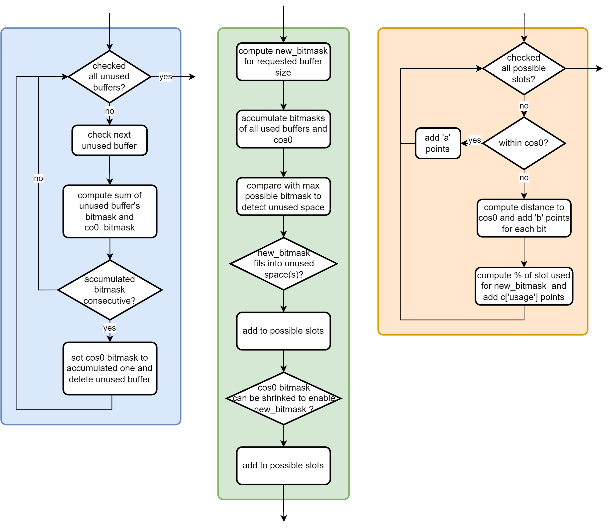

# ExCAT for Ansible

This project provides the Exclusive Cache Allocation Technology (ExCAT) in the context of Ansible. The ExCAT feature is used by integrating the component into an existing Ansible project's playbook (see Section [Integration into existing project](#integration-into-existing-project)). Everything that's needed to do so is contained within the `excat` directory.
For demonstration purposes, the `example` directory contains a minimal example project that integrates ExCAT and that is described in Section [Example project](#example-project).

## Content

<!-- TOC GitLab -->

- [ExCAT for Ansible](#excat-for-ansible)
  - [Overview](#overview)
  - [Integration into existing project](#integration-into-existing-project)
  - [Dependencies](#dependencies)
- [Example project](#example-project)
  - [Credentials](#credentials)
  - [Passwordless SSH](#passwordless-ssh)
  - [ExCAT Integration](#excat-integration)
  - [Run playbook](#run-playbook)

<!-- /TOC -->

## Overview

ExCAT for Ansible runs a given workload on one of the provided hosts and assigns an exclusive cache buffer to the workload. The cache is assigned based on the Cache Allocation Technology (CAT) that is part of the Intel® Resource Director Technology (RDT) feature set. In this project we're using the Linux RDT kernel driver that enables a pseudo-file system representing the RDT features at `/sys/fs/resctrl`.

For this to work, the CPU has to support CAT and the feature has to be enabled based on the kernel config `CONFIG_X86_CPU_RESCTRL`. This can be checked by means of the flags `cat_l2` and `cat_l3` in `/proc/cpuinfo` that represent CAT support for cache level 2 and 3, respectively.

The workload can either be an executable file, or a containerized workload provided as an image packaged in a tar-ball.

```bash
cat /proc/cpuinfo | grep cat
```

The feature is implemented according to the following flow chart:



Details of the colored boxes are shown here:



The general procedure as shown in above diagrams is:

1. Check CAT support, mounted `resctrl` filesystem and existing buffers
2. Remove unused buffers
3. Collect all possible slots for the buffer to be created
4. Add grades to possible slots depending on how good a slot is
5. Choose best slot and create buffer there
6. Start the workload on the respective node and assign the created buffer to it

When checking for possible slots within a hosts' cache, there are two possible locations for the required buffer to be created:

1. Within unused space (that results from cache buffers that are not used anymore and that are removed by the playbook)
2. Within `cos0` which is the default class of service (cos)

The terms class, cos and buffer are used interchangably within this project. `cos0` is the cache space that all processes use per default and that usually occupies the whole cache after startup. The more exclusive buffers we create, the smaller `cos0` gets and thus all remaining processes have less and less cache available.
To ensure a minimum size is available for the default cos, one of the variables that can be specified is `min_defaultclass_size` (see 3rd step in Section [Integration into existing project](#integration-into-existing-project)).
It defines the minimum amount of cache used for `cos0` in percentage of the whole size for the specified level.

In case of a containerized workload, the container is started using [podman](https://github.com/containers/podman) and all processes of the container are assigned to the created buffer based on an OCI hook. For this to work, [runc](https://github.com/opencontainers/runc) is used as the underlaying container runtime.

## Integration into existing project

The following steps describe how to integrate ExCAT into your project:

1. Import ExCAT within your parent playbook by means of adding the `import_playbook` statement like so

   ```yaml
   ---
   # Parent playbook
   - hosts: someHosts
     tasks:
       # some other tasks
       ...

   ...

   # Import the ExCAT feature
   - import_playbook: path/to/excat/main.yaml
   ```

2. Add an `ExCAT_hosts` group to your inventory and add all hosts that should be considered for running your workload. Example `hosts.yaml`:

   ```yaml
   ---
   all:
     children:
       Other_hosts:
         hosts:
           ...

       ExCAT_hosts:
         hosts:
           192.168.0.1:
           192.168.0.2:
           192.168.0.3:
   ```

3. Adapt your workload requirements within `excat/group_vars/all/workload.yaml`:

   ```yaml
   ---
   cache_level_request: 2
   buffer_size_request: 128000
   path2workload: /path/to/workload/myContainerImage.tar
   containerized: true
   podman_run_flags: ""
   min_defaultclass_size: 50
   path2logfile: ""
   debug: false
   ```

   with
   - `cache_level_request`:   cache level that the cache buffer should be created in
   - `buffer_size_request`:   the size of the exclusive cache buffer
   - `path2workload`:         path to the executable (or image tar-ball if `containerized: true`) that shall be started utilizing ExCAT
   - `containerized`:         set to `true` if the workload is provided using a tar-ed container image; set to `false` for an executable file
   - `podman_run_flags`:      additional flags to add to the `podman run` command for containerized workloads
   - `min_defaultclass_size`: minimum size of the default class (in percentage of the whole cache) that all processes run in per default
   - `path2logfile`:          path to a file on the host where the workload will run; the stdout and stderr of your workload will be written to this file; if empty, `/tmp/<buffer_name>` will be used with `<buffer_name>` being the name of the cache buffer that will be created in `/sys/fs/resctrl/`; not applicable for containerized workloads
   - `debug=true`:            get more verbose output with debug set to true

   If you have the need for dynamically assigning one of these variables, you can do so by adding them to a `vars` section below the `import_playbook` like so:

   ```yaml
   ...

   # Import the ExCAT feature
   - import_playbook: path/to/excat/main.yaml
     vars:
       path2workload: "{{ path2workload_fact }}"
   ```

   The value within `excat/group_vars/all/workload.yaml` will then be ignored. `path2workload_fact` in this example is a variable that holds the path to the workload and that has been set before in your parent playbook with the `set_fact` module.

**Note:**

- Some of the tasks within ExCAT require root privileges. Make sure to add the required access rights to your playbook.
- Be aware that whatever executable (or image if `containerized: true`) `path2workload` points to will be started and run on one of the nodes in the inventory. So make sure that this is not used wrongly.

## Dependencies

Make sure to have the following dependencies installed on your hosts. Installation instruction examples are given for Debian 12 and Ubuntu 22.04.

- python3
  - `apt install python3`
- pyyaml
  - `apt install python3-yaml`
- for containerized workloads:
  - iptables (for containerized workloads)
    - `apt install iptables`
  - jq (will be installed by the playbook)
  - runc: [version 1.1.9](https://github.com/opencontainers/runc/releases/tag/v1.1.9) or later

# Example project

The small example project in `example` demonstrates how to integrate ExCAT as described in the previous Section. For the example to work, it provides credentials for root access and enables for passwordless SSH. This is explained in the following sections.

## Credentials

To provide credentials for root access, for each host in the `example/hosts.yaml` file, we add the `user` and `password` to the file `example/group_vars/all/credentials.yaml`.

```yaml
---
credentials:
  192.168.0.1:
    user: myUser1
    password: "myPwd1"
  192.168.0.2:
    user: myUser2
    password: "myPwd2"
  192.168.0.3:
    user: myUser2
    password: "myPwd2"
```

**Note:** The user should have root priviledges.

If the file is complete, it is encrypted by means of

```bash
ansible-vault encrypt --vault-id <vaultID>@prompt example/group_vars/all/credentials.yaml
```

with `<vaultID>` being any ID that you can remember that denotes the password you will be requested to provide and that is used to encrypt the file. This ID and the password have to be provided when the playbook is run.

To edit the file after it has been encrypted use

```bash
ansible-vault edit example/group_vars/all/credentials.yaml
```

To change the password and/or the ID, see the [Ansible docs](https://docs.ansible.com/ansible/latest/user_guide/vault.html#changing-the-password-and-or-vault-id-on-encrypted-files)

## Passwordless SSH

To be able for the playbook to connect to the nodes without the need of entering passwords, a key-pair of a private key on the ansible-host (the host from which the ansible playbook is run) and the public key on each host is used. For this, generate a key-pair with

```bash
ssh-keygen -b 2048 -t rsa -N "" -f ~/.ssh/id_rsa
```

and then copy the public key content in `~/.ssh/id_rsa.pub` to `~/.ssh/authorized_keys` on all hosts. This can be done with

```bash
ssh-copy-id -i ~/.ssh/id_rsa.pub <user>@<ip>
```

with `<user>` being the user on the appropriate host and `<ip>` the IP address.
The playbook `example/copy_keys.yaml` is automating this last copy step. It works based on the credentials encrypted earlier and can be used like so

```bash
ansible-playbook --vault-id <vaultID>@prompt copy_keys.yaml
```

with `<vaultID>` being the ID that you've used when encrypting the file `example/group_vars/all/credentials.yaml`.

## ExCAT Integration

To integrate ExCAT as described in Section [Integration into existing project](#integration-into-existing-project), the workload requirements are adapted in `excat/group_vars/all/workload.yaml`. Furthermore, an `ExCAT_hosts` group is added to the `example/hosts.yaml` file and the ExCAT playbook is imported into the example playbook `example/main.yaml`.

Have a look at the files within the `example` directory for further details and adapt them to your needs.

## Run playbook

To run the playbook, from within the `example` directory do

```bash
ansible-playbook --vault-id <vaultID>@prompt main.yaml
```

with `<vaultID>` being the ID that you've used when encrypting the file `example/group_vars/all/credentials.yaml`.
